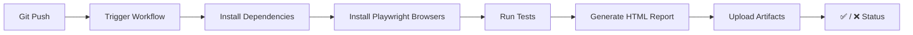

<div align="center">

# 🎭 QA Automation Engineer | Playwright Specialist

### _Building Robust, Scalable Test Automation Frameworks_

<br>

[](https://github.com/Rida-Khan08/Automation-Testing/actions)
[](https://github.com/Rida-Khan08/Automation-Testing/actions)
[](https://github.com/Rida-Khan08/Automation-Testing/actions)
[](https://opensource.org/licenses/MIT)
[](https://playwright.dev)
[](https://nodejs.org)

<br>


</div>

---

## 👩‍💻 About Me

Hi! I'm **Rida Khan**, a passionate **QA Automation Engineer** specializing in **Playwright Test Automation**. I design, develop, and maintain end-to-end automation frameworks that ensure software quality, reliability, and seamless user experiences across modern web applications.

---

## 🚀 Featured Projects

<div align="center">

| 📱 **E-Commerce Testing Suite** | 🚗 **RealSync Fleet Tracking** | ✅ **TodoMVC Testing** |
|:---:|:---:|:---:|
|  |  |  |
| [**View Project**](./Playwright-e2e-suite-master) | [**View Project**](./RealSync-QA-Platform) | [**View Project**](./TodoMVC) |

</div>

### 📱 1. E-Commerce Platform Testing Suite
Complete end-to-end automation suite for **SauceDemo** e-commerce platform, demonstrating:
- ✅ Page Object Model (POM) architecture
- ✅ Login/Authentication testing
- ✅ Shopping cart operations (add, remove, update)
- ✅ Product search & filtering
- ✅ Form validation & negative scenarios

**Test Coverage:** 8+ E2E user journeys

### 🚗 2. RealSync Fleet Tracking (API Automation)
Real-time fleet tracking system with comprehensive API test automation:
- ✅ RESTful API testing (GET, POST, PUT, DELETE)
- ✅ Driver registration & status management
- ✅ Ride creation & driver assignment workflows
- ✅ WebSocket connection testing
- ✅ Health check endpoint monitoring

**Stack:** Express.js, WebSocket, Playwright API Testing

### ✅ 3. TodoMVC Testing Suite
Comprehensive test suite for the classic TodoMVC application:
- ✅ CRUD operations (Create, Read, Update, Delete)
- ✅ Filter testing (All, Active, Completed)
- ✅ Double-click edit functionality
- ✅ Clear completed todos
- ✅ Counter validation

---

## 🛠️ Tech Stack & Skills

<div align="center">

### Core Technologies


### Testing Frameworks & Tools


### CI/CD & DevOps


### Testing Methodologies


</div>

---

## 🔄 CI/CD Pipeline

All projects are integrated with **GitHub Actions** for continuous testing:



**Pipeline Features:**
- 🚀 Automated test execution on every push
- 📊 HTML test reports as artifacts
- 🔄 Auto-retry on flaky tests (CI only)
- 📸 Screenshots & videos on failure
- ⚡ Parallel test execution

---

## 💡 Skills Demonstrated

<div align="center">

### 🏆 Core Competencies

| Category | Skills |
|:---|:---|
| **🧪 Test Automation** | Framework Design, Page Object Model, Reusable Components |
| **📊 Test Design** | Test Case Design, Test Planning, Risk-Based Testing |
| **🔍 Bug Analysis** | Defect Identification, Root Cause Analysis, Bug Validation |
| **🛠️ Tools & Frameworks** | Playwright, k6, Postman, GitHub Actions |
| **📈 Reporting** | HTML Reports, Allure, Test Metrics |
| **🌐 Cross-Browser** | Chrome, Firefox, Safari, Edge, Mobile Emulation |

</div>

---

## 🏃 How to Run Locally

### Prerequisites
- Node.js 22.x or higher
- Git installed

### Installation

**1. Clone the repository:**
```bash
git clone https://github.com/Rida-Khan08/Automation-Testing.git
cd Automation-Testing
```

**2. Choose a project:**

<details>
<summary><b>📱 E-Commerce Suite</b></summary>

```bash
cd Playwright-e2e-suite-master
npm install
npx playwright install --with-deps
npx playwright test
```
</details>

<details>
<summary><b>🚗 RealSync API Tests</b></summary>

```bash
cd RealSync-QA-Platform/Sut
npm install
npx playwright install --with-deps
npm start          # In one terminal
npx playwright test  # In another terminal
```
</details>

<details>
<summary><b>✅ TodoMVC Tests</b></summary>

```bash
cd TodoMVC
npm install
npx playwright install --with-deps
npx playwright test
```
</details>

**3. View the HTML report:**
```bash
npx playwright show-report
```

---

## 📊 Test Execution Stats

<div align="center">

| 📈 Metric | 🔢 Count |
|:---|:---:|
| **Total Test Files** | 10+ |
| **Total Test Cases** | 25+ |
| **Automation Coverage** | 85%+ |
| **Average Execution Time** | < 3 minutes |
| **CI/CD Integration** | ✅ Active |
| **Cross-Browser Support** | Chrome, Firefox, Safari |

</div>

---

## 🎯 What Makes This Portfolio Stand Out?

- ✨ **Production-Ready Frameworks**: Modular, maintainable, and scalable test architectures
- 🔄 **CI/CD Integrated**: Automated testing on every commit with GitHub Actions
- 📚 **Multiple Testing Types**: E2E, API, Functional, Load Testing coverage
- 🎭 **Page Object Model**: Clean separation of concerns with reusable page components
- 📊 **Rich Reporting**: HTML reports with traces, screenshots, and videos on failure
- 🌐 **Cross-Browser Testing**: Consistent test execution across major browsers
- 🚀 **Performance Testing**: k6 load testing for stress & performance validation

---

## 📫 Let's Connect

<div align="center">

[](mailto:ridakhan.0802@gmail.com)
[](https://www.linkedin.com/in/rida-khan12345/)
[](https://github.com/Rida-Khan08)

<br>

 <em>**"Automation is not about replacing testers; it's about empowering them to do more."**</em>

</div>

---

<div align="center">

### 🙏 Thank You for Visiting!


<br>


</div>
