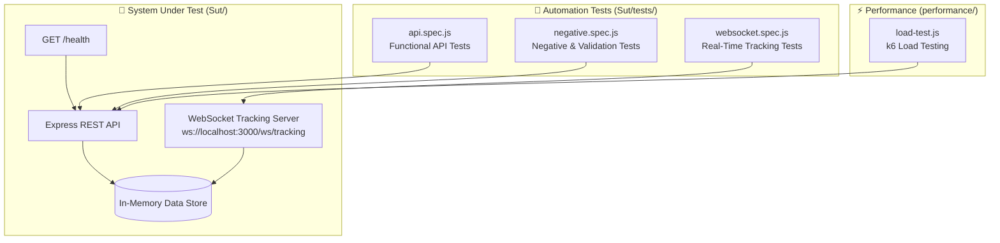

<div align="center">

# 🚗 RealSync QA Platform

### _Real-Time Fleet Tracking System with API, WebSocket & Performance Test Automation_

<br>

[](https://github.com/Rida-Khan08/Automation-Testing/actions)
[](https://nodejs.org)
[](https://expressjs.com)
[](https://playwright.dev)
[](https://developer.mozilla.org/en-US/docs/Web/API/WebSocket)
[](https://k6.io)

<br>


</div>

---

## 📖 Project Overview

**RealSync** is a **real-time fleet tracking system** built as a System Under Test (SUT), wrapped with a **complete QA automation suite** covering:

- 🧪 **Functional API Testing** | REST endpoints validation
- ⛔ **Negative Testing** | Error handling & input validation
- 🔌 **WebSocket Testing** | Real-time tracking event verification
- ⚡ **Performance Testing** | k6 load & stress testing
- 🏗️ **Service Layer Architecture** | POM-style reusable API service classes

---

## 🏗️ Architecture



---

## 🧪 Test Suites & Coverage

### 1️ Functional API Tests — `api.spec.js`

| # | Scenario | Flow | Expected |
|:---:|:---|:---|:---:|
| 1 | **Health Check** | `GET /health` | 200 + `status: up` |
| 2 | **Driver Registration** | Create new driver | 201 Created |
| 3 | **Driver Status Update** | Set driver → `online` | 200 OK |
| 4 | **Ride Creation** | Pickup/drop coordinates payload | 201 Created |
| 5 | **Driver Assignment** | Assign online driver to ride | 200 OK |

### 2️⃣ Negative & Validation Tests — `negative.spec.js`

- ⛔ Invalid / missing payload handling
- ⛔ Non-existent driver & ride IDs → proper 4xx errors
- ⛔ Invalid status transitions
- ⛔ Malformed coordinate validation
- ⛔ Edge-case boundary values

### 3️⃣ WebSocket Real-Time Tests — `websocket.spec.js`

- 🔌 Connection establishment to `ws://localhost:3000/ws/tracking`
- 📡 Live fleet tracking event streaming
- 🔄 Real-time driver location updates
- ❌ Connection failure & reconnection handling

### 4️⃣ Performance Testing — `performance/load-test.js` (k6)

- 📈 Virtual users ramp-up simulation
- ⏱️ Response time thresholds (p95, p99)
- 🎯 Error rate checks under load
- 💥 Stress testing for breaking-point analysis

---

## 🏗️ Service Layer (POM for APIs)

Reusable, maintainable service classes following **Page Object Model** principles adapted for API testing:

```
Sut/tests/Pages/
├── BaseService.js     # Shared HTTP helpers & request wrapper
├── DriverService.js   # Driver registration, status & lifecycle APIs
└── RideService.js     # Ride creation & driver assignment APIs
```

✅ Separation of concerns  
✅ Reusable API actions  
✅ Clean, readable test specs  

---

## 📂 Project Structure

```
RealSync-QA-Platform/
├── Sut/                        # System Under Test
│   ├── server.js               # Express + WebSocket fleet tracking server
│   ├── package.json            # Dependencies (express, ws, cors, uuid)
│   ├── playwright.config.js    # Auto-starts server via webServer hook
│   └── tests/
│       ├── api.spec.js         # Functional API tests
│       ├── negative.spec.js    # Negative & validation tests
│       ├── websocket.spec.js   # Real-time WebSocket tests
│       └── Pages/              # Service layer classes (POM style)
│           ├── BaseService.js
│           ├── DriverService.js
│           └── RideService.js
├── performance/
│   └── load-test.js            # k6 load & stress tests
└── README.md
```

---

## 🏃 How to Run

### Prerequisites
- Node.js 22.x+
- Playwright
- k6 (for performance tests)

### 1️⃣ Install Dependencies
```bash
cd RealSync-QA-Platform/Sut
npm install
npx playwright install --with-deps
```

### 2️⃣ Run API & WebSocket Tests
```bash
npx playwright test
```
> 💡 The `server.js` **auto-starts** via Playwright's `webServer` hook — no manual server start needed!

### 3️⃣ Run Performance Tests (k6)
```bash
k6 run ../performance/load-test.js
```

### 4️⃣ View HTML Report
```bash
npx playwright show-report
```

---

## 🔄 CI/CD Integration

This project runs automatically on **GitHub Actions**:

- 🚀 Triggered on every push to `RealSync-QA-Platform/**`
- 📦 Installs dependencies + Playwright browsers
- 🧪 Executes full test suite (API + Negative + WebSocket)
- 📊 Uploads HTML report as artifact on completion

---

## 📊 Test Stats

<div align="center">

| 📈 Metric | 🔢 Value |
|:---|:---:|
| **Test Spec Files** | 3 (API + Negative + WebSocket) |
| **API Scenarios** | 10+ |
| **Performance Suite** | k6 Load + Stress |
| **Server Endpoints Covered** | Health, Drivers, Rides, WebSocket |
| **CI/CD** | ✅ GitHub Actions |
| **Architecture** | Service Layer (POM for APIs) |

</div>

---

## 🎯 Skills Demonstrated

- ✅ REST API Test Automation (Playwright `request` fixture)
- ✅ WebSocket / Real-Time Testing
- ✅ Negative & Boundary Value Testing
- ✅ Performance Testing with k6
- ✅ Service Layer / POM Design Pattern
- ✅ CI/CD Pipeline Integration
- ✅ Node.js + Express Server Understanding

---

<div align="center">

### _"Quality is not an act, it is a habit."_ 🎯

[️ Back to Main Portfolio](../README.md)

</div>
